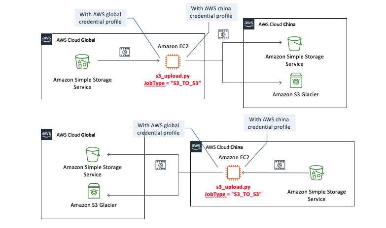
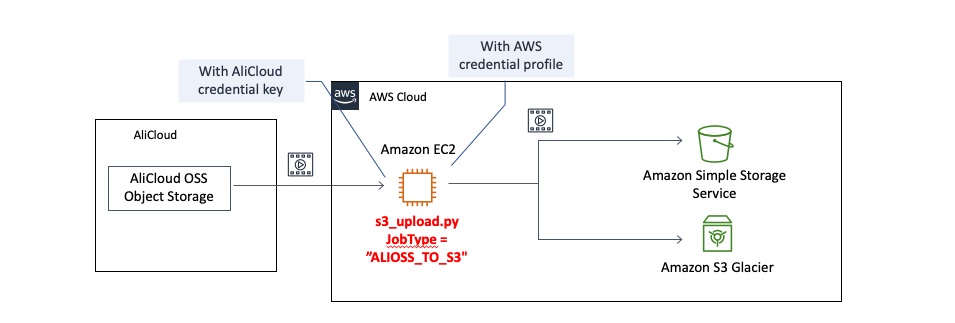

# Amazon S3 MultiThread Resume Upload Tool v1.1  (Amazon S3多线程断点续传)   

Muliti-thread Amazon S3 upload tool, breaking-point resume supported, suitable for large files  
多线程断点续传到 Amazon S3，适合批量的大文件  

Upload from local disk, copy files between Global AWS and China AWS S3, or migrate from AliCloud OSS to Amazon S3  
从本地硬盘上传，或海外与中国区 Amazon S3 之间互相拷贝，或从阿里云 OSS 迁移到 Amazon S3。  

Features:  
具体功能包括：  

* Split multipart and get from source, multi-thread upload to S3 and merge, support resume upload (Part level).   
源文件的自动分片获取，多线程并发上传到目的S3再合并文件，断点续传(分片级别)。  

* Support source: local files, Amazon S3, AliCloud OSS  
支持的源：本地文件、Amazon S3、阿里云 OSS  

* Support destination: Amazon S3  
支持的目的地：Amazon S3  

* Multi-files concurrently transmission and each file multi-threads download and upload.    
多文件并发传输，且每个文件再多线程并发传输，充分压榨带宽。S3_TO_S3 或 ALIOSS_TO_S3 中间只过中转服务器的内存，不落盘，节省时间和存储。  

* Auto-retry, progressive increase put off, auto-resume upload parts, MD5 verification on S3  
网络超时自动多次重传。重试采用递增延迟，延迟间隔=次数*5秒。程序中断重启后自动查询S3上已有分片，断点续传(分片级别)。每个分片上传都在S3端进行MD5校验，每个文件上传完进行分片合并时可选再进行一次S3的MD5与本地进行二次校验，保证可靠传输。  

* Auto iterate subfolders, and can also specify only one file.  
自动遍历下级子目录，也可以指定单一文件拷贝。  

* Support setup S3 storage class, such as: standard, S3-IA, Glacier or Deep Archive  
可设置S3存储级别，如：标准、S3-IA、Glacier或深度归档。  

* Can setup ouput info level  
可设置输出消息级别，如设置WARNING级别，则只输出你最关注的信息。
--------  
## Notice: 
* ChunkSize setting. Because Amazon S3 only support 10,000 parts for one single file, so e.g. ChunkSize 5MB can only support single file max 50GB, if you need to upload single file size 500GB, then you need ChunkSize at least 50MB  
注意：  
 ChunkSize 的大小设置。由于 Amazon S3 API 最大只支持单文件10,000个分片。例如设置 ChunkSize 5MB 最大只能支持单个文件 50GB，如果要传单个文件 500GB，则需要设置 ChunkSize 至少为 50MB。  

* If you need to change ChunkSize when files are transmitting, please stop application and restart, then select "CLEAN unfinished upload". Application will clean and re-upload all unfinished files.  
注意：  
如果某个文件传输到一半，你要修改 ChunkSize 的话。请中断，然后在启动时选择CLEAN unfinished upload，程序会清除未完成文件，并重新上传整个文件，否则文件断点会不正确。  

Language: Python 3.7   
by James Huang  
  
## Architecture 架构图  
1. Local upload to S3  

2. Between AWS Global S3 and China S3  

3. From AliCloud OSS to S3  

  
## Requirements
1. Install [Python](https://www.python.org/downloads/) 3.7 or above  
  

2. Install SDK  
Install aws python sdk boto3. If you need to copy from AliCloud OSS, you need to install oss2 package as well.   
该工具需要先安装 AWS SDK [boto3](https://github.com/boto/boto3)，如果需要从阿里云OSS拷贝，则还需要安装阿里 SDK [oss2](https://github.com/aliyun/aliyun-oss-python-sdk)。可以 pip 一起安装
```bash
    pip install -r requirements.txt --user
```

3. AWS Credential  
You need to make sure the credentials you're using have the correct permissions to access the Amazon S3
service. If you run into 'Access Denied' errors while running this sample, please follow the steps below.  
确认你的 IAM user 有权限访问对应的S3.  

* Log into the [AWS IAM Console](https://console.aws.amazon.com/iam/home)
* Navigate to the Users page. Find the AWS IAM user whose credentials you're using.
* Under the 'Permissions' section, attach the policy called 'AmazonS3FullAccess'
* Copy aws_access_key_id and aws_secret_access_key of this user for below setting
* Create file `"credentials"` in ~/.aws/ (`C:\Users\USER_NAME\.aws\` for Windows users) and save below content:  
创建文件名为 `"credentials"` 于 ~/.aws/ 目录(`C:\Users\USER_NAME\.aws\` for Windows users) 并保存以下内容:
```
[default]
region = <your region>
aws_access_key_id = <your access key id>
aws_secret_access_key = <your secret key>
```
上面 "default" 是默认 profle name，如果是S3 copy to S3你需要配置两个 profile ，一个是访问源 S3，一个是访问目的 S3。

For example：
```
[beijing]
region=cn-north-1
aws_access_key_id=XXXXXXXXXXXXXXX
aws_secret_access_key=XXXXXXXXXXXXXXXXXXXXXX

[oregon]
region=us-west-2
aws_access_key_id=XXXXXXXXXXXXXXX
aws_secret_access_key=XXXXXXXXXXXXXXXXXXXXXX
```
See the [Security Credentials](http://aws.amazon.com/security-credentials) page for more detail

4. If you need to copy from AliCloud OSS, you need AliCloud credentials to setup in s3_upload_config.py  
```
ali_SrcBucket = "your bucket name"  # 阿里云OSS 源Bucket，对于 LOCAL_TO_S3/S3_TO_S3 则本字段无效
ali_access_key_id = "xxxxxxxxxxx"  # 阿里云 RAM 用户访问密钥
ali_access_key_secret = "xxxxxxxxxxxx"
ali_endpoint = "oss-cn-beijing.aliyuncs.com"  # OSS 区域 endpoint，在OSS控制台界面可以找到
```

## Application Configure - 应用配置

Config `s3_upload_config.py`
* 上面配置的 profile name 填入对应源和目的 profile name 项，例如：  
```python
SrcProfileName = 'beijing'
DesProfileName = 'oregon'
```
* Setup source type  
'LOCAL_TO_S3' or 'S3_TO_S3' or 'ALIOSS_TO_S3'   
```python
JobType = 'LOCAL_TO_S3'
```
* Setup address  
设置源文件路径和上传的目的地址，以及其他可选配置

## Run the app - 运行应用
```bash
python3 s3_upload.py
```
## TCP BBR improve Network performance - 提高网络性能
If copy cross AWS Global and China, recommend to enable TCP BBR: Congestion-Based Congestion Control, which can improve performance.   
如果是跨 AWS Global 和中国区，推荐启用 TCP BBR: Congestion-Based Congestion Control，可以提高传输效率  

[Amazon Linux AMI 2017.09.1 Kernel 4.9.51](https://aws.amazon.com/cn/amazon-linux-ami/2017.09-release-notes/) or later version supported TCP Bottleneck Bandwidth and RTT (BBR) .  

BBR is `NOT` enabled by default. You can enable it on your EC2 Instance via:：
```
$ sudo modprobe tcp_bbr
$ sudo modprobe sch_fq
$ sudo sysctl -w net.ipv4.tcp_congestion_control=bbr
```
Persistent configuration should look like:
```
$ sudo su -

# cat <<EOF>> /etc/sysconfig/modules/tcpcong.modules
>#!/bin/bash
> exec /sbin/modprobe tcp_bbr >/dev/null 2>&1
> exec /sbin/modprobe sch_fq >/dev/null 2>&1
> EOF

# chmod 755 /etc/sysconfig/modules/tcpcong.modules

# echo "net.ipv4.tcp_congestion_control = bbr" >> /etc/sysctl.d/00-tcpcong.conf
```
## License

This library is licensed under the MIT-0 License. See the LICENSE file.
