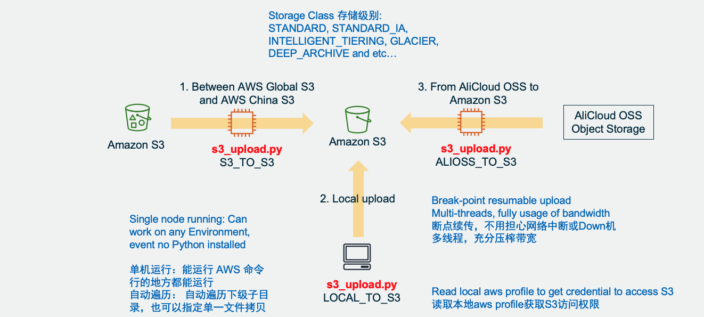
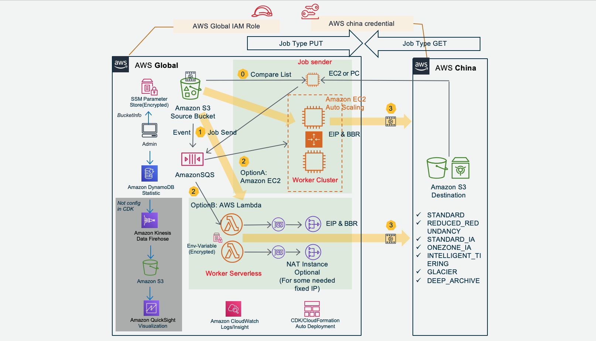

# Amazon S3 MultiThread Resume Migration Solution  (Amazon S3多线程断点续传迁移)   

Breaking-point resume supported, suitable for large files  
多线程断点续传，充分利用带宽，适合批量的大文件迁移到S3。  

Upload from local server, migrate files between Global AWS and China AWS S3, or migrate from AliCloud OSS to Amazon S3. Now support Single Node Version, Cluster Servers Version and Serverless AWS Lambda Version.  
从本地服务器上传，或海外与中国区 Amazon S3 之间互相拷贝，或从阿里云 OSS 迁移到 Amazon S3。现已支持单机版，多台服务器的集群版和无服务器 AWS Lambda 版本。  
  
### Features 功能：  

* Split multipart and get from source, multi-thread upload to S3 and merge, support resume upload (Part level).   
源文件的自动分片获取，多线程并发上传到目的S3再合并文件，断点续传(分片级别)，自动重传。  

* Single node version support source: local files, Amazon S3, AliCloud OSS  
Cluster and Serverless version support source: Amazon S3  
单机版支持的源：本地文件、Amazon S3、阿里云 OSS  
集群与Serverless版支持源：Amazon S3  

* Support destination: Amazon S3  
支持的目的地：Amazon S3  

* Multi-files concurrently transmission and each file multi-threads download and upload.    
多文件并发传输，且每个文件再多线程并发传输，充分压榨带宽。S3_TO_S3 或 ALIOSS_TO_S3 中间只过中转服务器的内存，不落盘，节省时间和存储。可支撑 MB, GB, TB, PB 级别的文件传输。对于海量KB级以下文件，性价比不好，建议打包压缩后再采用  

* Support setup S3 storage class, such as: standard, S3-IA, Glacier or Deep Archive  
可设置S3存储级别，如：标准、S3-IA、Glacier或深度归档。  

### Single Node Version 单机版  
* Single node: It can run on any place which can run AWS CLI, suitable for different kind of data source senario.  
单机运行：能运行 AWS 命令行的地方都能运行，适合各种数据源的场景  
* Auto traversal: Auto traversal sub-directory, can also specify to just one file copying  
自动遍历： 自动遍历下级子目录，也可以指定单一文件拷贝  
* Break-point resume upload, no worry of network breaken or server crash.  
断点续传，不用担心网络中断或Down机  
* Multiple thread concurrently transmission, fully usage of bandwidth.  
多线程，充分压榨带宽  
  
  [Single Node Version 进入单机版](./single_node/)
    
  Single node version architecture 单机版架构图如下：  
  

  
  
### Cluster and Serverless Version 集群与无服务器版本  
Amazon EC2 Autoscaling Group Cluster and Serverless AWS Lambda can be deployed together, or seperated used in different senario  
EC2自动扩展集群版本和无服务器Lambda版本，可以分别单独部署和运行在不同场景，也可以一起运行。  
* Transmission between AWS Global and AWS China: Cluster version is suitable for mass data migration. Serverless version is suitable for unschedule burst migration.  
海外和国内S3互传：集群版适用于海量文件传输，无服务器版适合不定期突发传输。  
* Fast and stable: Multiple nodes X Multiple files/node X Multiple threads/file. Support mass of hugh file concurrently migration. TCP BBR is enable for cluster to accelerating.  
快速且稳定：多节点 X 单节点多文件 X 单文件多线程，支撑海量巨型文件并发传输。启用BBR加速。  
* Reliability: SQS queue managed files level jobs, break-point resume trasmission, with timeout protection. Every part will be verified with MD5 after transmission. Single Point of True, final file merging takes the destination S3 as standard, to ensure integrity.  
可靠：SQS消息队列管理文件级任务，断点续传，超时中断保护。每个分片MD5完整性校验。Single Point of True，最终文件合并以S3上的分片为准，确保分片一致。  
* Security: Transfer in memory, no writing to disk. SSL encryption on transmission. Open source for audit. Leverage IAM role and ParameterStore(KMS) to store credential Access Key.  
安全：内存转发不写盘，传输SSL加密，开源代码可审计，采用IAM Role和利用 ParameterStore 加密存储密钥 AcceesKey。  
* Controlable operation: Job dispatched match the speed of transmission. System capacity predictable. DynamoDB and SQS read/write frequency only related to file numbers, no related to file size. Auto-collect logs to CloudWatch log group. AWS CDK auto deploy.   
可控运营：任务派发与传输速度相匹配，系统容量可控可预期；DynamoDB和SQS读写次数只与文件数相关，而与文件大小基本无关；日志自动收集；AWS CDK自动部署；  
* Elastic cost optimization: Cluster auto scale up and down, combining with EC2 spot to save cost. Serverless AWS Lambda only pay for invocation. Support all kind of S3 Storage Class, save long term storage cost.  
弹性成本优化：集群自动扩展，结合EC2 Spot节省成本；无服务器Lambda只按调用次数计费；支持直接存入S3各种存储级别，节省长期存储成本。  
* Serverless solution with AWS Lambda can also support large file of tens of GBytes size with unique resumable technique, no worry of 15 mins timeout of Lambda.  
  
  [Cluster Version 进入集群版](./cluster/)  
  [Serverless Version 进入无服务器版](./serverless/)  
      
  Cluster&Serverless Architeture 集群和无服务器版架构图如下：  
  
  

### Limitation 局限
* It doesn't support version control, but only get the lastest version of object from S3. Don't change the original file while copying.  
本项目不支持S3版本控制，相同对象的不同版本是只访问对象的最新版本，而忽略掉版本ID。即如果启用了版本控制，也只会读取S3相同对象的最后版本。目前实现方式不对版本做检测，也就是说如果传输一个文件的过程中，源文件更新了，会到导致最终文件出错。解决方法是在完成批次迁移之后再运行一次Jobsender，比对源文件和目标文件的Size不一致则会启动任务重新传输。但如果Size一致的情况，目前不能识别。  

* Don't change the chunksize while start data copying.  
不要在开始数据复制之后修改Chunksize。  

* It only compare the file Bucket/Key and Size. That means the same filename in the same folder and same size, will be taken as the same by jobsender or single node uploader.  
本项目只对比文件Bucket/Key 和 Size。即相同的目录下的相同文件名，而且文件大小是一样的，则会被认为是相同文件，jobsender或者单机版都会跳过这样的相同文件。如果是S3新增文件触发的复制，则不做文件是否一样的判断，直接复制。  

* It doesn't support Zero Size object.  
本项目不支持传输文件大小为0的对象。  

### TCP BBR improve Network performance - 提高网络性能
If copy cross AWS Global and China, recommend to enable TCP BBR: Congestion-Based Congestion Control, which can improve performance.   
如果是跨 AWS Global 和中国区，推荐启用 TCP BBR: Congestion-Based Congestion Control，可以提高传输效率  

[Amazon Linux AMI 2017.09.1 Kernel 4.9.51](https://aws.amazon.com/cn/amazon-linux-ami/2017.09-release-notes/) or later version supported TCP Bottleneck Bandwidth and RTT (BBR) .  

BBR is `NOT` enabled by default. You can enable it on your EC2 Instance via:：
```
$ sudo modprobe tcp_bbr
$ sudo modprobe sch_fq
$ sudo sysctl -w net.ipv4.tcp_congestion_control=bbr
```
Persistent configuration should look like:
```
$ sudo su -

# cat <<EOF>> /etc/sysconfig/modules/tcpcong.modules
>#!/bin/bash
> exec /sbin/modprobe tcp_bbr >/dev/null 2>&1
> exec /sbin/modprobe sch_fq >/dev/null 2>&1
> EOF

# chmod 755 /etc/sysconfig/modules/tcpcong.modules

# echo "net.ipv4.tcp_congestion_control = bbr" >> /etc/sysctl.d/00-tcpcong.conf
```

## License

This library is licensed under the MIT-0 License. See the LICENSE file.
